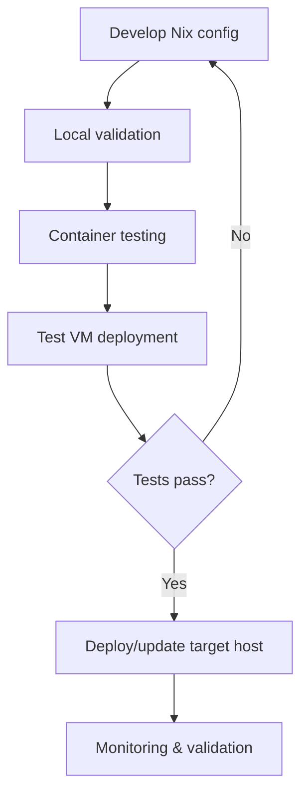

# Agent VM Setup Guide

> **Status:** `agent-sandbox` is deployed according to `docs/architecture/infrastructure-registry.md` (VM ID 105, `10.0.0.5`). Some commands below are historical/local deployment helpers and may need adjustment before reuse.

## Overview

The Agent VM is an autonomous sandbox environment where Claude Code can operate with `--dangerously-accept-permissions` to develop, test, and deploy homelab infrastructure safely. This guide covers setup and operations for the deployed VM plus historical build/deploy workflows.

## Quick Start

### 1. Verify or Redeploy the Agent VM

The canonical deployed endpoint is `agent@10.0.0.5`.

```bash
# Check current deployed VM status
ssh agent@10.0.0.5 'hostname && uptime'

# Historical helper for rebuilding/redeploying if needed
./scripts/deploy-agent-vm.sh status
./scripts/deploy-agent-vm.sh deploy
```

### 2. Set Up SSH Access

```bash
# Set up SSH keys for secure access
./scripts/deploy-agent-vm.sh setup-keys

# Test SSH connection
./scripts/deploy-agent-vm.sh ssh
```

### 3. Claude Code and Codex Ready to Use

Claude Code and Codex are pre-installed. Claude runs with autonomous permissions, and Codex uses the agent profile's autonomous approval and sandbox settings. Simply SSH in and start working:

```bash
# Connect to the VM
./scripts/deploy-agent-vm.sh ssh

# Start Claude Code in autonomous mode
claude-workspace

# Start Codex in the same workspace layout
codex-workspace

# Or use specific workspace shortcuts
claude-homelab     # Start Claude in homelab workspace
claude-testing     # Start Claude in testing workspace
claude-deploy      # Start Claude in deployment workspace
codex-homelab      # Start Codex in homelab workspace
codex-testing      # Start Codex in testing workspace
codex-deploy       # Start Codex in deployment workspace
```

## Configuration

### Environment Variables

Configure the deployment by setting these environment variables:

```bash
export AGENT_VM_ID=900                    # VM ID on Proxmox
export PROXMOX_HOST=proxmox.local         # Proxmox hostname
export PROXMOX_USER=root                  # Proxmox username
export PROXMOX_STORAGE=local-zfs          # Storage backend
export AGENT_CPU_CORES=4                 # CPU cores
export AGENT_MEMORY_MB=8192               # Memory in MB
export AGENT_DISK_SIZE=40                 # Disk size in GB
```

### VM Specifications

**Default Configuration:**
- **CPU**: 4 cores (host passthrough for performance)
- **Memory**: 8GB RAM (suitable for development tasks)
- **Storage**: 40GB disk (extendable as needed)
- **Network**: Bridged networking with firewall enabled
- **OS**: NixOS with UEFI boot

## Features

### Security & Isolation

- **Network isolation**: Restricted outbound access to essential services only
- **Resource limits**: CPU, memory, and disk I/O constraints
- **Container isolation**: Dedicated bridge network for container testing
- **Firewall**: Restrictive rules with logging of blocked connections
- **SSH hardening**: Key-only authentication with fail2ban protection

### Development Environment

- **Claude Code and Codex**: Pre-installed with autonomous permissions, writable runtime config files, and agent-specific skills
- **Tmux**: Pre-configured with sessionizer and session resurrection
- **Development tools**: Git, Nix toolchain, container tools, network debugging
- **Terminal optimization**: Modern CLI tools (bat, eza, ripgrep, fzf)
- **Shell configuration**: Optimized bash with helpful aliases and functions

### Workspace Structure

```
/home/agent/
├── workspace/          # Main development area
│   ├── homelab/       # Infrastructure projects  
│   ├── testing/       # Local test environments
│   └── deployments/   # Deployment configurations
├── templates/         # Reusable configuration templates
├── scripts/           # Automation scripts
└── logs/             # Agent operation logs
```

## Daily Operations

### Starting Work

1. **Connect to the VM**:
   ```bash
   ./scripts/deploy-agent-vm.sh ssh
   ```

2. **Start tmux session**:
   ```bash
   # Use sessionizer to navigate projects
   tmux-sessionizer

   # Or create specific session
   tnew homelab-dev
   ```

3. **Launch Claude Code**:
   ```bash
   # Use pre-configured shortcuts for autonomous operation
   claude-homelab        # Start in homelab workspace
   claude-testing        # Start in testing workspace
   claude-deploy         # Start in deployment workspace
   ```

### Tmux Sessions

The VM automatically creates and maintains tmux sessions:

- **main**: Default session created on login
- **homelab**: Infrastructure development
- **testing**: Local testing and validation
- **deployment**: VM/container deployment tasks
- **monitoring**: System monitoring and logs

**Tmux Shortcuts:**
- `Ctrl+b f` - Launch sessionizer (fuzzy find projects)
- `Alt+arrows` - Navigate panes without prefix
- `Shift+arrows` - Switch windows
- `Ctrl+b |` - Split horizontally
- `Ctrl+b -` - Split vertically

### Helpful Commands

```bash
# System status
agent-status

# Development shortcuts
nix-build-dry           # Dry-run build
nix-flake-check        # Validate flake
nix-fmt                # Format Nix files

# Container management
docker-clean           # Clean Docker system
podman-clean          # Clean Podman system

# Quick navigation
workspace homelab     # Navigate to workspace/homelab
mkcd new-project      # Create and enter directory
```

## AI Tool Configuration

### Mutable Claude and Codex Runtime Files

Claude and Codex defaults come from Home Manager modules, but activation materializes them as writable regular files so the tools can update local state at runtime.

| Tool | Runtime files | Source module |
| --- | --- | --- |
| Claude Code | `~/.claude/settings.json`, `~/.claude/rules/`, `~/.claude/skills/` | `home/modules/ai-claude.nix` |
| Codex | `~/.codex/config.toml`, `~/.codex/AGENTS.md`, `~/.codex/skills/` | `home/modules/ai-codex.nix` |

Activation replaces legacy read-only Nix-store symlinks with regular files or directories. Existing regular files are preserved and made user-writable, so later Nix default changes do not overwrite local edits. To reapply a Nix default, remove the specific mutable file or skill directory and run Home Manager activation again.

Codex defaults use `model = "gpt-5-codex"` and `model_reasoning_effort = "medium"` for ChatGPT account compatibility. The `agent-sandbox` profile keeps those model settings and overrides approval/sandbox settings for autonomous VM operation in `home/modules/ai-agent.nix`.

### Agent-Specific Skills

The agent VM comes with specialized skills for infrastructure development:

- **nix-flake**: Flake development and management
- **nix-homelab**: Proxmox/VM deployment patterns
- **nix-lang**: Nix expression development
- **nix-debug**: Build error resolution
- **homelab-architect**: Infrastructure design patterns
- **vm-deployment**: Automated VM provisioning
- **container-management**: OCI service management

These skills are defined once in `home/modules/ai/` and exposed through the shared `myHome.ai.skills` registry. Home Manager activation materializes them into both Claude and Codex runtime skill directories as writable regular files, while also exporting provider-agnostic copies under `~/.local/share/ai/`.

### Recommended Prompts

1. **System Context**:
   ```
   I'm an autonomous agent running in a sandbox VM designed for homelab infrastructure development. I have access to Nix tooling, container runtimes, and deployment scripts. My workspace is isolated and I can safely use --dangerously-accept-permissions.
   ```

2. **Safety Guidelines**:
   ```
   Operating boundaries:
   - Develop and test configurations locally first
   - Use container isolation for service testing
   - Validate configurations before deployment
   - Document all infrastructure changes
   - Follow established Nix conventions
   ```

## Deployment Workflow

### Testing New Services

1. **Develop configuration**:
   ```bash
   cd ~/workspace/homelab
   vim systemModules/new-service.nix
   ```

2. **Local validation**:
   ```bash
   nix build --dry-run .#nixosConfigurations.new-service
   nix flake check
   nixfmt systemModules/new-service.nix
   ```

3. **Container testing**:
   ```bash
   # Test OCI container locally
   docker run --rm -p 8080:8080 new-service:latest
   ```

4. **VM deployment**:
   ```bash
   # Deploy to test VM
   nixos-rebuild switch --target-host user@test-vm --flake .#new-service
   ```

### Service Development Cycle



## Troubleshooting

### Common Issues

**VM won't start:**
```bash
# Check VM status on Proxmox
ssh root@proxmox.local "qm status 900"

# Check logs
ssh root@proxmox.local "journalctl -u qmeventd"
```

**SSH connection failed:**
```bash
# Regenerate SSH keys
rm ~/.ssh/agent_vm_ed25519*
./scripts/deploy-agent-vm.sh setup-keys
```

**Build failures:**
```bash
# Update flake inputs
nix flake update

# Check syntax
nixfmt --check .

# Validate configuration
nix flake check
```

### Resource Monitoring

Monitor resource usage from within the VM:

```bash
# System overview
agent-status

# Detailed monitoring
htop            # Process monitoring
iotop           # I/O monitoring  
nethogs         # Network usage
docker stats    # Container resources
```

### Log Locations

- **System logs**: `journalctl -f`
- **SSH access**: `/var/log/ssh-monitor.log`
- **Container logs**: `docker logs <container>` / `podman logs <container>`
- **Agent activity**: `~/logs/`

## Maintenance

### Regular Tasks

1. **Update configurations**:
   ```bash
   ./scripts/deploy-agent-vm.sh config
   ```

2. **System updates**:
   ```bash
   # On the VM
   sudo nixos-rebuild switch --upgrade-all
   ```

3. **Cleanup**:
   ```bash
   # Clean old generations
   sudo nix-collect-garbage -d
   
   # Clean containers
   docker system prune -af
   podman system prune -af
   ```

### Backup Important Data

The VM workspace should be backed up regularly:

```bash
# From host system
rsync -av agent@<vm-ip>:~/workspace/ ./backups/agent-workspace/
```

### Rebuilding VM

If the VM needs to be rebuilt:

```bash
# Destroy old VM
./scripts/deploy-agent-vm.sh destroy

# Deploy new VM
./scripts/deploy-agent-vm.sh deploy

# Restore workspace (if backed up)
scp -r ./backups/agent-workspace/ agent@<vm-ip>:~/workspace/
```

## Next Steps

After setting up the basic agent VM:

1. **Configure Claude Code skills** - Set up agent-specific skills and prompts
2. **Develop automation scripts** - Create deployment and testing automation  
3. **Set up monitoring** - Configure service health checks and alerting
4. **Create templates** - Build reusable service configuration templates
5. **Document workflows** - Establish procedures for common infrastructure tasks

## Security Considerations

- **Network isolation**: The VM has restricted network access
- **Resource limits**: CPU, memory, and disk usage are monitored and limited
- **Container isolation**: Services run in isolated container networks
- **SSH hardening**: Key-only authentication with intrusion detection
- **Regular updates**: System and security updates should be applied regularly

The agent VM provides a safe, isolated environment for infrastructure experimentation while maintaining security boundaries to protect your broader homelab network.
