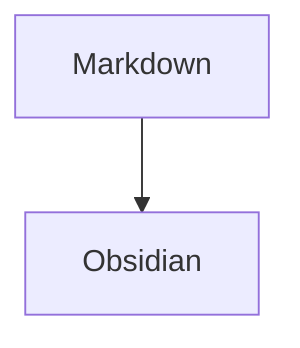

# Sandvim Markdown Runtime

sandvim-phase10-sentinel

- [ ] Verify documentation pack
- [x] Preserve completed task

| Feature | Owner |
| --- | --- |
| Structural lint | markdownlint-cli2 |
| Prose | Harper |
| Links | markdown-oxide |

See [[Second Brain]] and embedded ![[diagram.png]].

> [!note]
> Callout rendering should stay available.

%% Obsidian comment %%

Reference block target. ^phase10-block

Footnote marker.[^phase10]

[^phase10]: Footnote content survives formatting.

